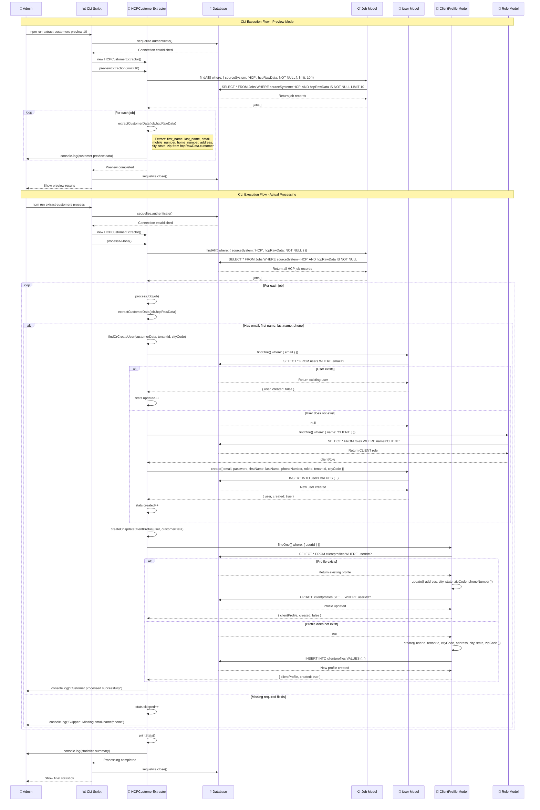
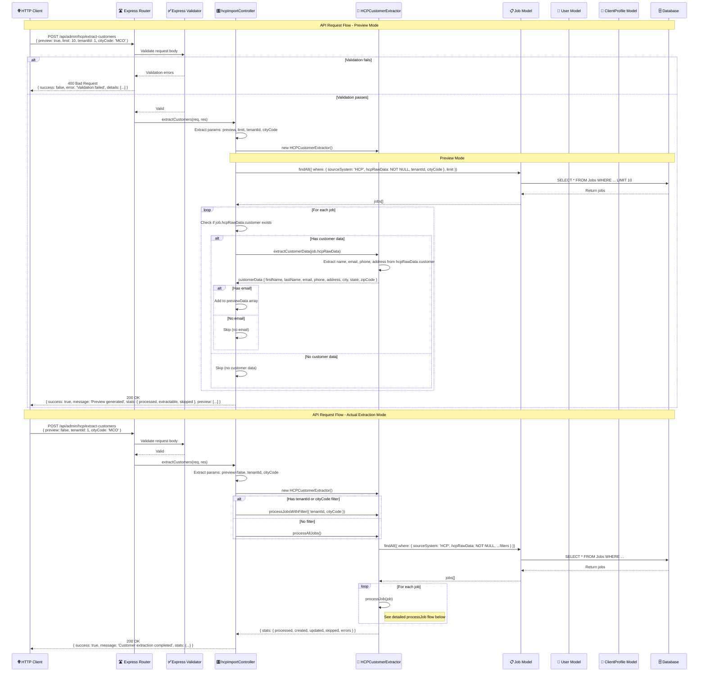
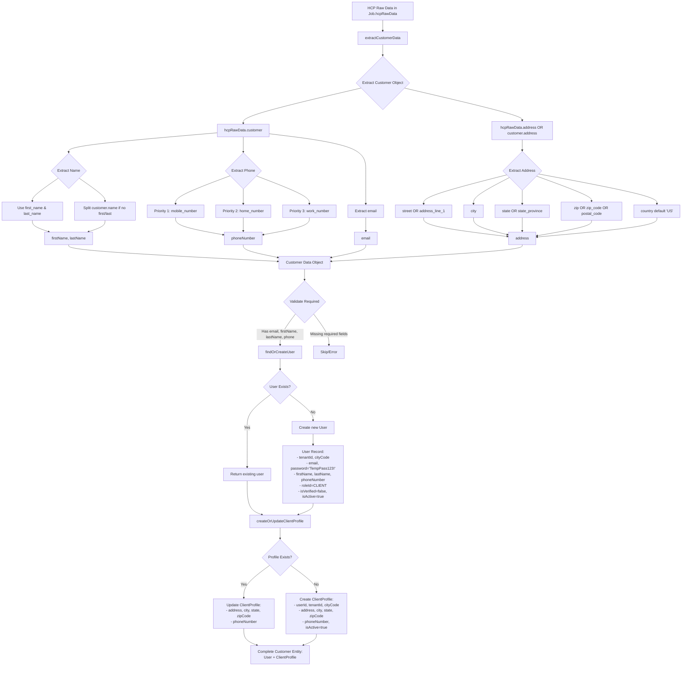

# Customer Extraction Sequence Diagram

## Overview
This document illustrates the flow of extracting customer data from HCP raw data stored in the Jobs table and creating corresponding User and ClientProfile entities.

## End-to-End Flow: CLI → Database → Customer Creation



## API Flow: HTTP Request → Controller → Extractor Service



## Detailed Processing Flow: Single Job Customer Extraction

```mermaid
sequenceDiagram
    participant Extractor as 🔧 HCPCustomerExtractor
    participant Job as 📋 Job Record
    participant UserModel as 👥 User Model
    participant ProfileModel as 📇 ClientProfile Model
    participant RoleModel as 🔑 Role Model
    participant DB as 🗄️ Database

    Note over Extractor, DB: Processing Single Job
    Extractor->>Extractor: processJob(job)
    Extractor->>Extractor: stats.processed++

    alt No hcpRawData
        Extractor->>Extractor: stats.skipped++
        Extractor->>Extractor: console.log("No HCP raw data")
        Extractor-->>Extractor: return
    end

    Extractor->>Extractor: extractCustomerData(job.hcpRawData)

    Note right of Extractor: Extract from hcpRawData.customer:<br/>- first_name, last_name (or split name)<br/>- email<br/>- mobile_number || home_number || work_number<br/>- address.street/address_line_1<br/>- address.city, state, zip<br/>- country (default 'US')

    alt No customer data
        Extractor->>Extractor: stats.skipped++
        Extractor->>Extractor: console.log("No customer data")
        Extractor-->>Extractor: return
    end

    alt No email
        Extractor->>Extractor: stats.skipped++
        Extractor->>Extractor: console.log("No email")
        Extractor-->>Extractor: return
    end

    Extractor->>Extractor: findOrCreateUser(customerData, job.tenantId, job.cityCode)

    alt Missing firstName, lastName, or phoneNumber
        Extractor->>Extractor: throw Error('Required fields missing')
        Extractor->>Extractor: stats.errors++
        Extractor-->>Extractor: return
    end

    Extractor->>UserModel: findOne({ where: { email }, include: ClientProfile })
    UserModel->>DB: SELECT * FROM users WHERE email=? LEFT JOIN clientprofiles...
    DB-->>UserModel: Query result

    alt User exists
        UserModel-->>Extractor: existing user
        Extractor->>Extractor: console.log("User already exists")
        Extractor->>Extractor: userCreated = false
    else User does not exist
        UserModel-->>Extractor: null

        Extractor->>RoleModel: findOne({ where: { name: 'CLIENT' } })
        RoleModel->>DB: SELECT * FROM roles WHERE name='CLIENT'

        alt CLIENT role not found
            DB-->>RoleModel: null
            RoleModel->>Extractor: throw Error('Client role not found')
            Extractor->>Extractor: stats.errors++
            Extractor-->>Extractor: return
        else CLIENT role found
            DB-->>RoleModel: clientRole
            RoleModel-->>Extractor: clientRole

            Extractor->>UserModel: create({<br/>  tenantId, cityCode, email,<br/>  password: 'TempPass123!',<br/>  firstName, lastName, phoneNumber,<br/>  roleId: clientRole.id,<br/>  isVerified: false, isActive: true<br/>})
            UserModel->>DB: INSERT INTO users VALUES (...)
            DB-->>UserModel: New user record
            UserModel-->>Extractor: new user
            Extractor->>Extractor: console.log("Created new user")
            Extractor->>Extractor: userCreated = true
        end
    end

    Extractor->>Extractor: createOrUpdateClientProfile(user, customerData)
    Extractor->>ProfileModel: findOne({ where: { userId: user.id } })
    ProfileModel->>DB: SELECT * FROM clientprofiles WHERE userId=?
    DB-->>ProfileModel: Query result

    alt Profile exists
        ProfileModel-->>Extractor: existing profile
        Extractor->>ProfileModel: update({<br/>  address, city, state, zipCode,<br/>  phoneNumber, tenantId, cityCode<br/>})
        ProfileModel->>DB: UPDATE clientprofiles SET ... WHERE userId=?
        DB-->>ProfileModel: Updated profile
        ProfileModel-->>Extractor: { clientProfile, created: false }
        Extractor->>Extractor: console.log("Updated client profile")
    else Profile does not exist
        ProfileModel-->>Extractor: null
        Extractor->>ProfileModel: create({<br/>  userId, tenantId, cityCode,<br/>  address, city, state, zipCode,<br/>  phoneNumber, isActive: true<br/>})
        ProfileModel->>DB: INSERT INTO clientprofiles VALUES (...)
        DB-->>ProfileModel: New profile record
        ProfileModel-->>Extractor: { clientProfile, created: true }
        Extractor->>Extractor: console.log("Created client profile")
    end

    alt userCreated
        Extractor->>Extractor: stats.created++
    else user existed
        Extractor->>Extractor: stats.updated++
    end

    Extractor->>Extractor: console.log("Customer processed successfully")
```



## Error Handling Flow

```mermaid
sequenceDiagram
    participant Extractor as 🔧 HCPCustomerExtractor
    participant Job as 📋 Job Record
    participant DB as 🗄️ Database

    Note over Extractor, DB: Error Scenarios

    alt No hcpRawData field
        Extractor->>Extractor: processJob(job)
        Extractor->>Extractor: Check job.hcpRawData
        Extractor->>Extractor: stats.skipped++
        Extractor->>Extractor: console.log("No HCP raw data")
        Extractor-->>Extractor: return (skip job)
    end

    alt No customer in hcpRawData
        Extractor->>Extractor: extractCustomerData(hcpRawData)
        Extractor->>Extractor: Check hcpRawData.customer
        Extractor->>Extractor: return null
        Extractor->>Extractor: stats.skipped++
        Extractor->>Extractor: console.log("No customer data")
        Extractor-->>Extractor: return (skip job)
    end

    alt No email address
        Extractor->>Extractor: extractCustomerData(hcpRawData)
        Extractor->>Extractor: customer.email is null/undefined
        Extractor->>Extractor: stats.skipped++
        Extractor->>Extractor: console.log("No email")
        Extractor-->>Extractor: return (skip job)
    end

    alt Missing first name, last name, or phone
        Extractor->>Extractor: findOrCreateUser(customerData)
        Extractor->>Extractor: Validate required fields
        Extractor->>Extractor: throw Error('Required fields missing')
        Extractor->>Extractor: Catch error in processJob
        Extractor->>Extractor: stats.errors++
        Extractor->>Extractor: console.error("Error processing job")
        Extractor-->>Extractor: continue (next job)
    end

    alt CLIENT role not found
        Extractor->>Extractor: findOrCreateUser(customerData)
        Extractor->>DB: SELECT * FROM roles WHERE name='CLIENT'
        DB-->>Extractor: null
        Extractor->>Extractor: throw Error('Client role not found')
        Extractor->>Extractor: Catch error in processJob
        Extractor->>Extractor: stats.errors++
        Extractor->>Extractor: console.error("Client role not found")
        Extractor-->>Extractor: continue (next job)
    end

    alt Database connection error
        Extractor->>DB: Any database operation
        DB-->>Extractor: Error (connection lost, timeout, etc.)
        Extractor->>Extractor: Catch error in processJob
        Extractor->>Extractor: stats.errors++
        Extractor->>Extractor: console.error("Database error")
        Extractor-->>Extractor: continue (next job)
    end

    alt Validation error (duplicate email unique constraint)
        Extractor->>DB: INSERT INTO users ...
        DB-->>Extractor: Error: Duplicate key violation
        Extractor->>Extractor: Catch error in processJob
        Extractor->>Extractor: stats.errors++
        Extractor->>Extractor: console.error("Duplicate email")
        Extractor-->>Extractor: continue (next job)
    end
```



## Data Transformation Details



## Key Components and Their Roles

| Component | Role | Key Functions |
|-----------|------|---------------|
| **HCPCustomerExtractor** | Main extraction service | - extractCustomerData()<br>- findOrCreateUser()<br>- createOrUpdateClientProfile()<br>- processJob()<br>- processAllJobs() |
| **hcpImportController** | API endpoint handler | - extractCustomers()<br>- Preview mode<br>- Actual extraction mode<br>- Request validation |
| **Job Model** | Source of HCP data | - Stores hcpRawData JSONB field<br>- Contains customer info from HCP<br>- Query HCP jobs |
| **User Model** | User authentication | - Email-based user accounts<br>- Password management<br>- Role association<br>- Tenant isolation |
| **ClientProfile Model** | Customer details | - Address information<br>- Phone numbers<br>- Preferences<br>- Links to User |
| **Role Model** | Access control | - CLIENT role for customers<br>- Permission management |

## Data Fields Mapping

### HCP Raw Data → Customer Data Object

| HCP Field | Extracted As | Used For |
|-----------|--------------|----------|
| `customer.first_name` | `firstName` | User.firstName |
| `customer.last_name` | `lastName` | User.lastName |
| `customer.name` | Split into firstName, lastName | Fallback if first/last not present |
| `customer.email` | `email` | User.email (unique identifier) |
| `customer.mobile_number` | `phoneNumber` (priority 1) | User.phoneNumber, ClientProfile.phoneNumber |
| `customer.home_number` | `phoneNumber` (priority 2) | User.phoneNumber, ClientProfile.phoneNumber |
| `customer.work_number` | `phoneNumber` (priority 3) | User.phoneNumber, ClientProfile.phoneNumber |
| `address.street` or `address.address_line_1` | `address` | ClientProfile.address |
| `address.city` | `city` | ClientProfile.city |
| `address.state` or `address.state_province` | `state` | ClientProfile.state |
| `address.zip` or `address.zip_code` or `address.postal_code` | `zipCode` | ClientProfile.zipCode |
| N/A | `country` = 'US' (default) | ClientProfile (future field) |

### Customer Data Object → Database Models

| Customer Data Field | User Model Field | ClientProfile Model Field |
|---------------------|------------------|---------------------------|
| `firstName` | `firstName` | - |
| `lastName` | `lastName` | - |
| `email` | `email` | - |
| `phoneNumber` | `phoneNumber` | `phoneNumber` |
| `address` | - | `address` |
| `city` | - | `city` |
| `state` | - | `state` |
| `zipCode` | - | `zipCode` |
| Job.tenantId | `tenantId` | `tenantId` |
| Job.cityCode | `cityCode` | `cityCode` |
| 'TempPass123!' | `password` (bcrypt hashed) | - |
| CLIENT role | `roleId` | - |
| false | `isVerified` | - |
| true | `isActive` | `isActive` |

## CLI Commands

| Command | Description | Example |
|---------|-------------|---------|
| `npm run extract-customers preview [limit]` | Preview extraction without creating records | `npm run extract-customers preview 5` |
| `npm run extract-customers process` | Process all HCP jobs and create customers | `npm run extract-customers process` |
| `npm run extract-customers process-tenant <id>` | Process jobs for specific tenant only | `npm run extract-customers process-tenant 1` |
| `npm run extract-customers process-city <code>` | Process jobs for specific city only | `npm run extract-customers process-city MCO` |

## API Endpoints

### POST /api/admin/hcp/extract-customers

**Request Body (Preview Mode):**
```json
{
  "preview": true,
  "limit": 10,
  "tenantId": 1,
  "cityCode": "MCO"
}
```

**Response (Preview Mode):**
```json
{
  "success": true,
  "message": "Preview generated for 8 extractable customers from 10 jobs",
  "stats": {
    "processed": 10,
    "extractable": 8,
    "skipped": 2
  },
  "preview": [
    {
      "jobNumber": "JOB12345",
      "customerName": "John Doe",
      "email": "john.doe@example.com",
      "phone": "(555) 123-4567",
      "address": "123 Main St",
      "city": "Orlando",
      "state": "FL",
      "zipCode": "32801"
    }
  ]
}
```

**Request Body (Extraction Mode):**
```json
{
  "preview": false,
  "tenantId": 1,
  "cityCode": "MCO"
}
```

**Response (Extraction Mode):**
```json
{
  "success": true,
  "message": "Customer extraction completed successfully",
  "stats": {
    "processed": 45,
    "created": 32,
    "updated": 8,
    "skipped": 3,
    "errors": 2
  }
}
```

## Statistics Tracking

| Statistic | Description | When Incremented |
|-----------|-------------|------------------|
| `processed` | Total jobs examined | Every job processed |
| `created` | New customers created | New User + ClientProfile created |
| `updated` | Existing customers found | Existing User found, profile updated |
| `skipped` | Jobs skipped | Missing required data (email, name, phone) |
| `errors` | Processing errors | Database errors, validation failures, role not found |

## Environment Requirements

- `DATABASE_URL` or PostgreSQL connection config in `.env`
- `NODE_ENV` for environment-specific behavior
- Active database connection to PostgreSQL
- `roles` table must contain 'CLIENT' role
- `users` and `clientprofiles` tables must exist (via migrations)

## Performance Considerations

1. **Batch Processing**: Processes jobs sequentially to avoid overwhelming database
2. **Duplicate Detection**: Checks for existing users by email before creating
3. **Transaction Safety**: Each job processed independently (failure doesn't affect others)
4. **Memory Management**: Uses Sequelize query methods with proper limits
5. **Logging**: Console logging for debugging and progress tracking
6. **Error Isolation**: Errors in one job don't stop processing of remaining jobs