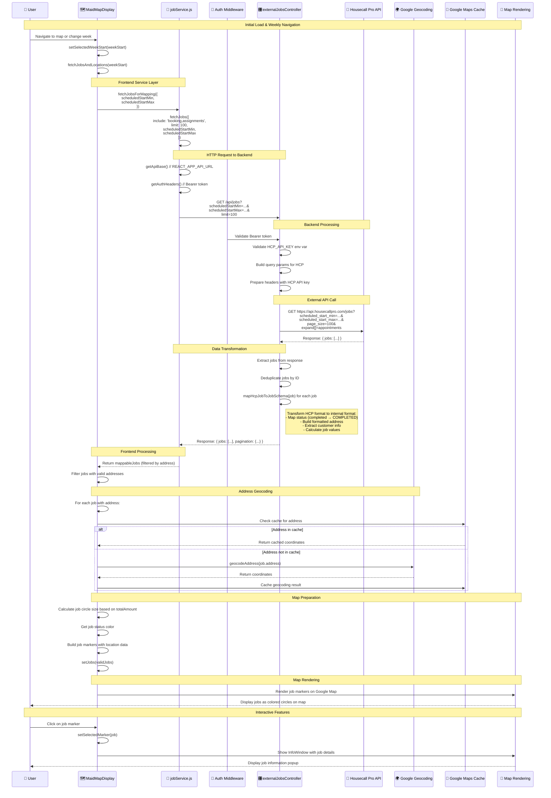
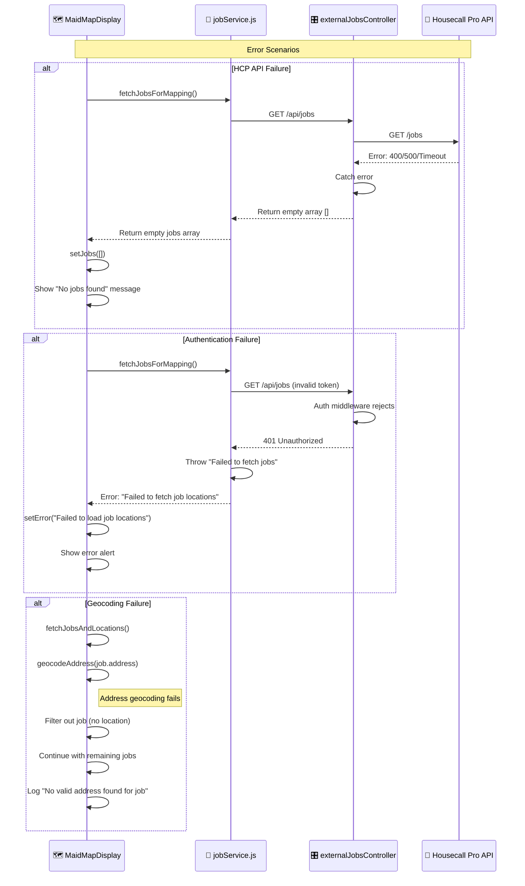
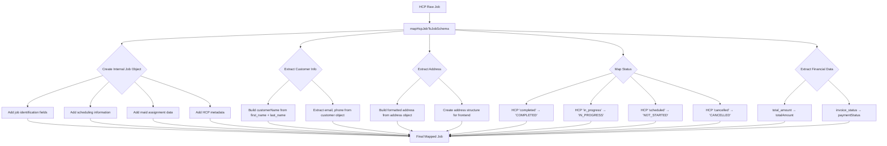

# Job Fetch Sequence Diagram for MaidMapDisplay

## End-to-End Flow: Frontend → Backend → Housecall Pro → Map Display

## Error Handling Flow

## Data Transformation Details

## Key Components and Their Roles

| Component | Role | Key Functions |
|-----------|------|---------------|
| **MaidMapDisplay** | Frontend UI Component | - Initiates job fetching - Handles weekly navigation - Manages map state - Renders job markers |
| **jobService.js** | Frontend Service Layer | - HTTP requests to backend - Data filtering and processing - Error handling - Address extraction |
| **externalJobsController** | Backend Controller | - HCP API integration - Data transformation - Error handling - Response formatting |
| **Housecall Pro API** | External Data Source | - Provides job data - Handles date filtering - Returns paginated results |
| **Google Geocoding** | Address Processing | - Converts addresses to coordinates - Caches results - Handles geocoding errors |
| **Google Maps Cache** | Performance Optimization | - Stores geocoding results - Reduces API calls - Improves response time |

## Environment Variables Used

- `REACT_APP_API_URL` - Backend API base URL
- `HCP_API_KEY` - Housecall Pro API authentication
- `REACT_APP_TENANT_ID` - Multi-tenant filtering
- `REACT_APP_CITY_CODE` - Geographic filtering
- `REACT_APP_GOOGLE_MAPS_API_KEY` - Google Maps/Geocoding API

## Performance Optimizations

1. **Caching**: Google Maps geocoding results cached to reduce API calls
2. **Batch Processing**: Multiple addresses processed in batches
3. **Deduplication**: Removes duplicate jobs from HCP response
4. **Filtering**: Only processes jobs with valid addresses
5. **Pagination**: Limits results to prevent overwhelming the UI 